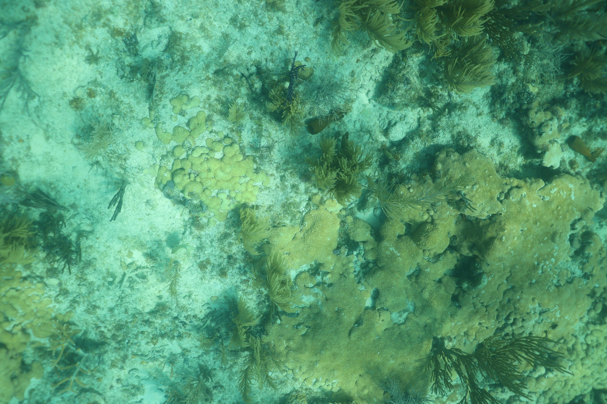
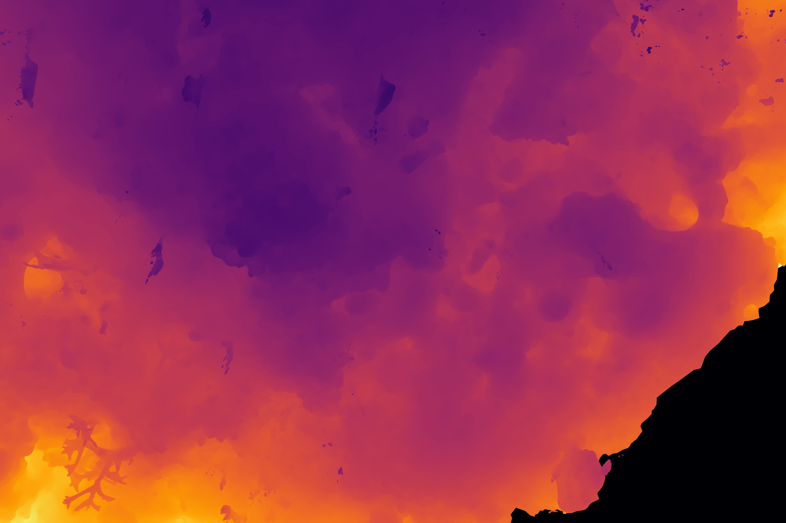
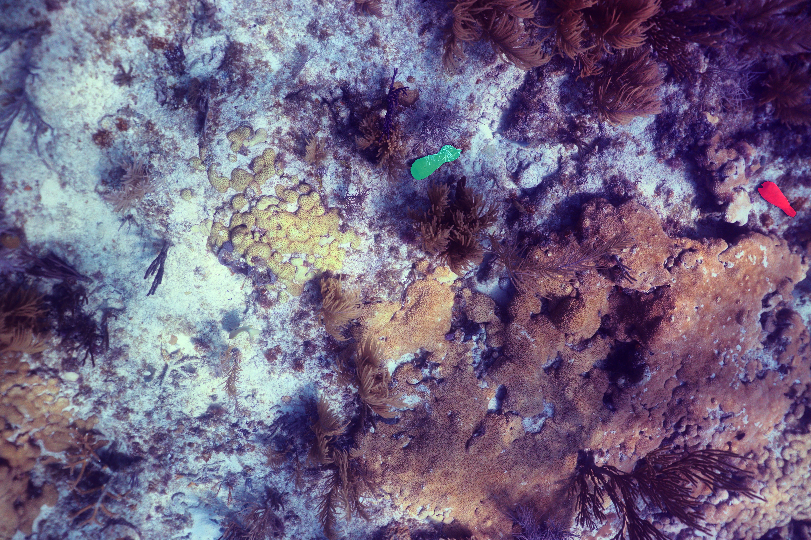
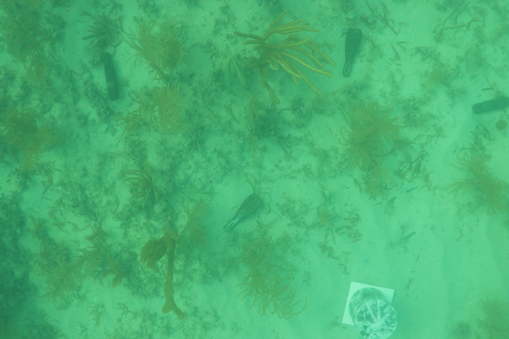
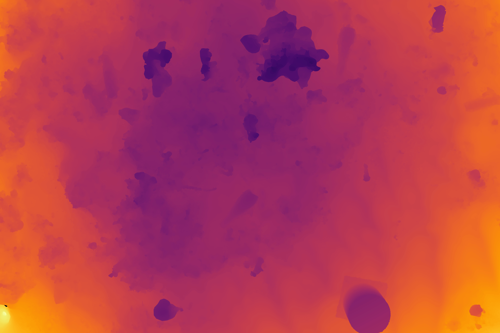
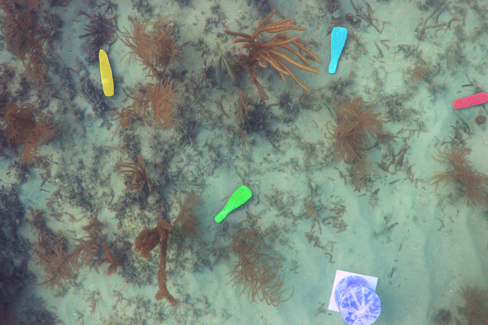
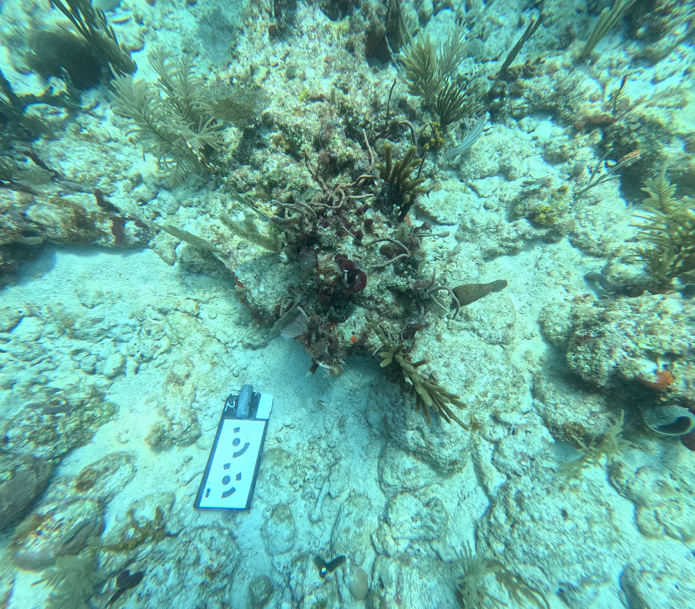
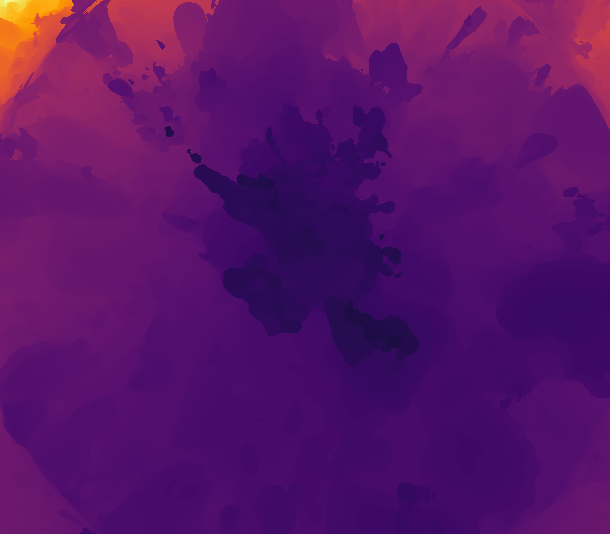
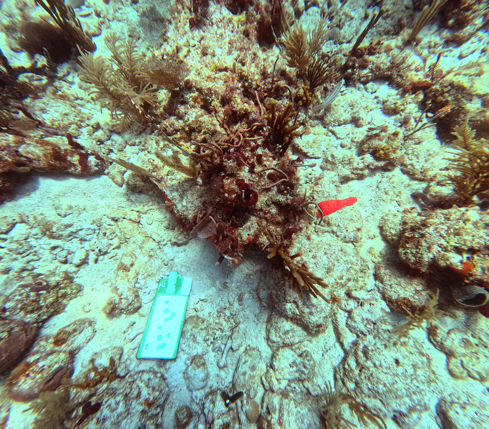

# SERDP Dataset Processing Pipeline


### Dataset Organization

This step involves processing the original image/depth/mask data to generate training patches.

**Input Data Format:**

The pipeline will organize the original data within a specifc directory structure under `dataset_dir` in the `config.yaml` file. The `dataset_dir` directory will host one or more days organized as folders. For each day, plot, camera folder combination, the following subdirectories and files will be organized in the following manner:

* `images`: Contains original 2D imagery.
* `depthmaps`: Contains corresponding depth maps, formatted as 1-channel, 16-bit PNGs.
* `masks`: Contains corresponding masks indicating the location of target objects, formatted as 1-channel, 8-bit PNGs and 3-channel, 8-bit PNGs and COCO annotations file.
* `cams.xml`: Contains the intrinsic and extrinsic information of the camera in the *Agisoft Metashape* format.
* `mesh.ply`: The 3D mesh file for ray tracing to generate the depth maps
* `seedpoints_on_images.csv`: Contains the u, v coordinates for each masking prompt in each image
* `seedpoints_in_3D.csv`: Contains the x, y, z coordinates for each masking prompt in the mesh
* `stats.csv`: Contains depth and viewing angle statistics for every image

***Example:***

```
input_dir/
└── day_1/
    ├── plot1/
    │   ├── GoPro/
    │   │   ├── images/
    │   │   │   ├── img_01.jpg
    │   │   │   └── ...
    │   │   ├── depthmaps/
    │   │   │   ├── img_01.png
    │   │   │   └── ...
    │   │   └── masks/
    │   │       ├── img_01.png
    │   │       └── ...
    │   ├── 24mm/
    │   │   ├── images/
    │   │   ├── depthmaps/
    │   │   └── masks/
    │   └── 35mm/
    │       └── ...
    ├── plot2/
    │   └── ...
    └── plot3/
        └── ...
└── day_2/
    ├── plot1/
    │   └── ...
    └── ...
```

## Example Output

<table style="width: 100%; text-align: center;"> 
  <tr>
    <th>Original Image</th>
    <th>Heat Map</th>
    <th>Mask Overlay</th>
  </tr>
  <tr>
    <td></td>
    <td></td>
    <td></td>
  </tr>
  <tr>
    <td></td>
    <td></td>
    <td></td>
  </tr>
  <tr>
    <td></td>
    <td></td>
    <td></td>
  </tr>
</table>
